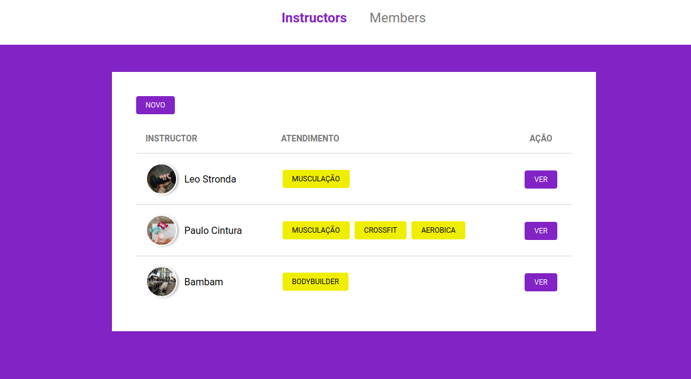
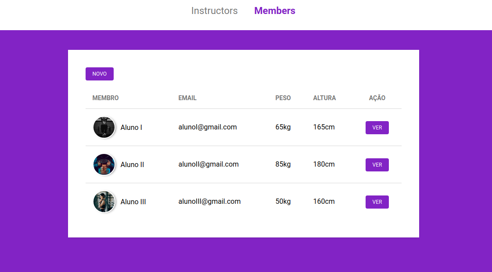
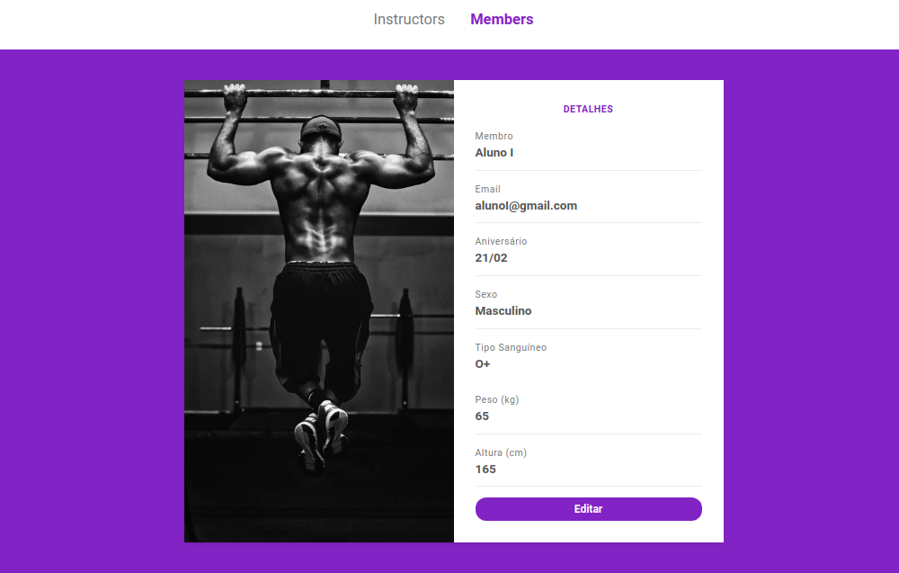
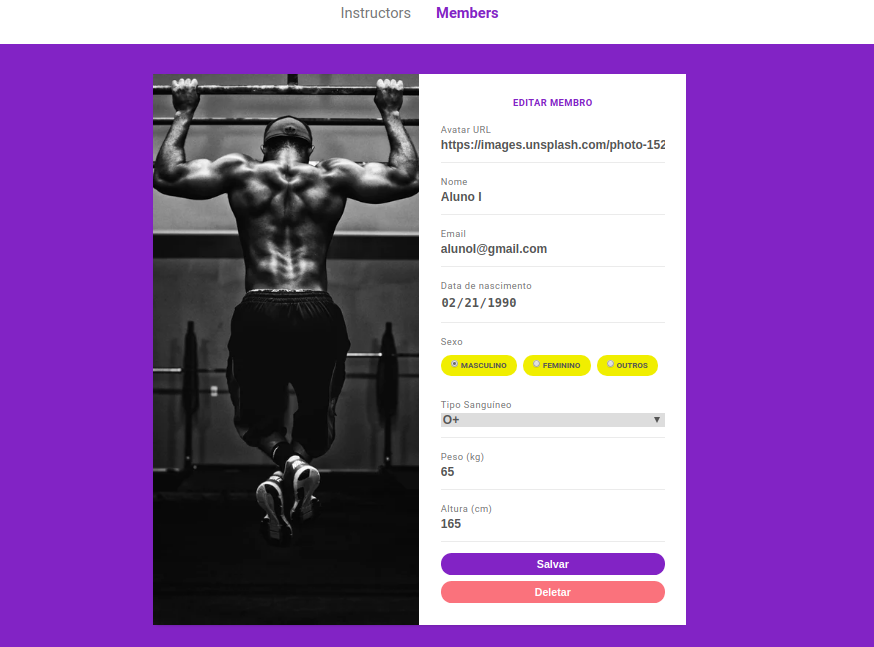

## A simple web-site page, where the following Noje.js, CSS, HTML and others tools were used. The web page is the description of a simple gym management system with dates save in localhost on a data.json archive this in a version 1.0, there are other version 2.0 with BD(postgree), MVC and pagination.

### Tools
  
* Node.js
* Express
* Nunjucks
* HTML
* CSS

### Instructors page

### Members page

### Details page

### Edit page

